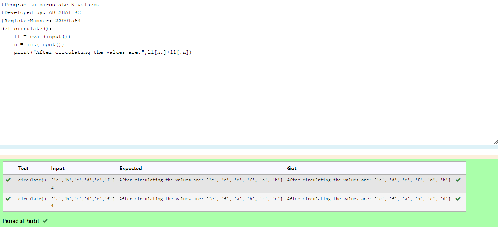

# Circulate-the-values-of-N-variables
## Aim:
To write a python program to circulate the n variables using function concept
## Equipment’s required:
PC
Anaconda - Python 3.7
## Algorithm: 
### Step 1: 
Define a function called circulate
### Step 2: 
Get the list of elements from the users in a list
### Step 3: 
Get the value from the user for the number of rotation
### Step 4: 
Using the slicing concept rotate the list

### Step 5: 
Finally print the output
### Step 6: 
Call the function 
## Program:
#Program to circulate N values.
#Developed by: ABISHAI KC
#RegisterNumber: 23001564
```
def circulate():
    l1 = eval(input())
    n = int(input())
    print("After circulating the values are:",l1[n:]+l1[:n])
```
## Output:

## Result:
Circulate-the-values-of-N-variables